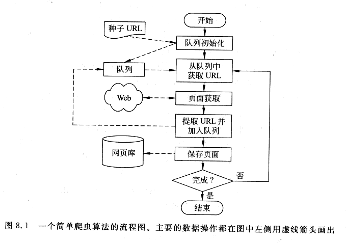
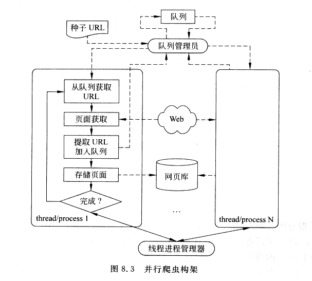
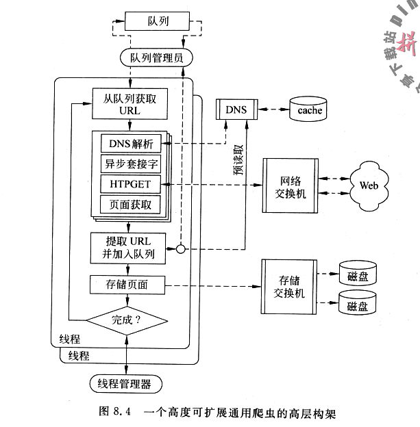
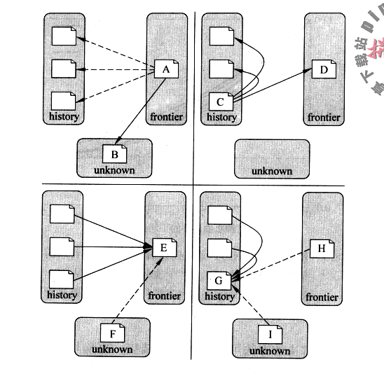
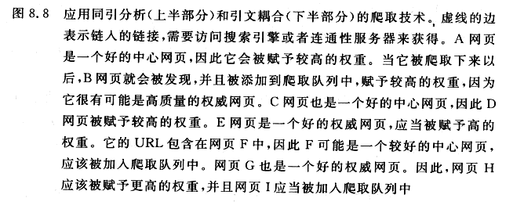
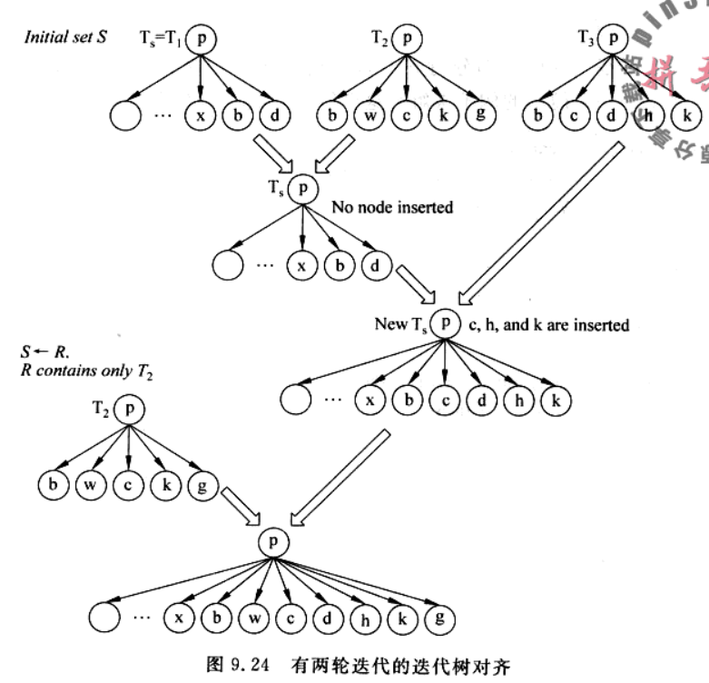

### 12.请总结信息检索的4种主要模型分别是什么？信息检索结果常用的评估标准是什么？
#### 效率：
时间开销、空间开销、响应速度
#### 效果：
返回的文档中有多少相关文档、所有相关文档中返回了多少、返回得靠不靠前
#### 其他：
覆盖率、访问量、数据更新速度
#### 单个查询的评价指标：
召回率、准确率
#### 多个查询评价指标：
##### 平均的求法：
###### 宏平均：
对所有查询一视同仁、微平均受返回相关文档数目比较大的查询影响
### 16.什么是社会网络？何谓中心性？常见的中心性分别是什么？何谓权威性？常见的实体权威性的方法主要是什么？
* 社会网络是一种基于“网络”（节点之间的相互连接）而非“群体”（明确的边界和秩序）的社会组织形式，也是西方社会学从 1960 年代兴起的一种分析视角。
* 中心性的概念：链接（连接）、中心参与者。
* 常见的中心性：①度中心性；②接近中心性；③中介中心性
* 权威性：一个有权威的参与者被定义为被大量链接指向的参与者。
#### 常见的实体权威性方法：
##### 度权威：
度量一个参与者的权威的最直接办法就是考察它的入度；
##### 邻近权威：
参与者i的度威望参数值考虑那些与i相邻参与者邻近权威在此基础上进行推广，对直接指向和间接指向i的参与者都进行考虑。
##### 等级权威：
一个参与者的等级权威是其他为该参与者投票或者选择该参与者的人登记的函数。
### 17.什么是同引分析？什么是引文耦合？可能的应用有哪些？
* 同引分析被用来度量两篇文档的相似性，论文i 和论文 j都被论文k引用，那么我们就可以说他们两个之间有某种程度上的关系，即便他们之间并没有直接引用。如果论文i和论文j被多篇论文同时引用那说明他们之间有非常紧密的关系或者他们的相似度非常高。
* 引文耦合采用一种相近的原则，但是其研究问题的方向跟同引分析不同，引文耦合将引用同一篇论文的两篇论文联系起来。如果论文i和论文j同时引用了同一篇论文k那么我们就认为他们两个之间存在某种关系即便他们之间不存在直接引用。两篇文章引用相同文章的数目越多，他们之间的相似度就越高
### 18.PAGERANK算法的基本原理是什么？试用实例说明算法的基本思想，并分析其优点及缺陷。指出可能的改进有哪些？
* PageRank是一种静态的网页评级算法，因为的它每个网页离线计算PageRank值而且该值与查询内容无关，既然PageRank算法基于社会关系网中对于权威的度量，那么每个网页的PageRank值就可以作为该网页的权威值
* 从一个网页指向另一个网页的超连接时一种对目标网站权威的隐含认可，这就是说，如果一个网页的链入链出越多则它的权威就越高。
* 指向网页i的网页本身也有权威值。一个拥有高权威值得网页指向i比一个低权威值得网页指向i更加重要。也就是说如果一个网页被其他重要的网页所指向，那么该网页也很重要。
#### 举例：
互联网中的网页可以看出是一个有向图，其中网页是结点，如果网页A有链接到网页B，则存在一条有向边A->B，下面是一个简单的示例：
* A B C D
* 0 1 1 0
* 1 0 0 1
* 1 0 0 1
* 1 1 0 0
* 如果当前在A网页，那么悠闲的上网者将会各以1/3的概率跳转到B、C、D，这里的3表示A有3条出链，如果一个网页有k条出链，那么跳转任意一个出链上的概率是1/k，同理D到B、C的概率各为1/2，而B到C的概率为0。一般用转移矩阵表示上网者的跳转概率，如果用n表示网页的数目，则转移矩阵M是一个n*n的方阵；如果网页j有k个出链，那么对每一个出链指向的网页i，有M[i][j]=1/k，而其他网页的M[i][j]=0；上面示例图对应的转移矩阵如下：
* 0   1/2 1 0
* 1/3 0   0 1/2
* 1/3 0   0 1/2
* 1/3 1/2 0 0
* 初始时，假设上网者在每一个网页的概率都是相等的，即1/n，于是初试的概率分布就是一个所有值都为1/n的n维列向量V0，用V0去右乘转移矩阵M，就得到了第一步之后上网者的概率分布向量MV0,（nXn）*(nX1)依然得到一个nX1的矩阵。下面是V1的计算过程：
* | 0   1/2 1 0    || 1/4 |   | 9/24 |
* | 1/3 0   0 1/2  || 1/4 |   | 5/24 |
* | 1/3 0   0 1/2  || 1/4 |   | 5/24 |
* | 1/3 1/2 0 0    || 1/4 | = | 5/24 |
* 注意矩阵M中M[i][j]不为0表示用一个链接从j指向i，M的第一行乘以V0，表示累加所有网页到网页A的概率即得到9/24。得到了V1后，再用V1去右乘M得到V2，一直下去，最终V会收敛，即Vn=MV(n-1)，上面的图示例，不断的迭代，最终V=[3/9,2/9,2/9,2/9]：
* | 1/4 || 9/24 || 15/48 || 11/32 |     | 3/9 |
* | 1/4 || 5/24 || 11/48 ||  7/32 |     | 2/9 |
* | 1/4 || 5/24 || 11/48 ||  7/32 |     | 2/9 |
* | 1/4 || 5/24 || 11/48 ||  7/32 | ... | 2/9 |
#### PageRank算法的优点和缺点
##### 优点：
* 防止作弊的发生，想要影响Pr的值是非常不易的。
* 其是从全局出发的度量以及其费查询相关的特性。在搜索的时候非常有效率
##### 缺点：
Pr不能分辨网页在广泛意义上是权威的还是仅仅在特定的查询话题上是权威的
### 19.HITS算法的基本思想是什么？与PAGERANK算法相比它们的主要异同是什么？HITS算法的优缺点是什么？
基本思想是：一个优秀的中心页必然会指向很多优秀的权威页，一个优秀的权威页必然会被很多优秀的中心页所指向。也就是说，权威页和中心页有一种互相促进（Mutual Reinforcement）的关系。
#### 比较：
* HITS算法是与用户输入的查询请求密切相关的，而PageRank与查询请求无关。所以，HITS算法可以单独作为相似性计算评价标准，而PageRank必须结合内容相似性计算才可以用来对网页相关性进行评价；
* HITS算法因为与用户查询密切相关，所以必须在接收到用户查询后实时进行计算，计算效率较低；而PageRank则可以在爬虫抓取完成后离线计算，在线直接使用计算结果，计算效率较高；
* HITS算法的计算对象数量较少，只需计算扩展集合内网页之间的链接关系；而PageRank是全局性算法，对所有互联网页面节点进行处理； 
* 从链接反作弊的角度来说，PageRank从机制上优于HITS算法，而HITS算法更易遭受链接作弊的影响。
##### 优点：
可以根据搜索内容来为网页评级，这样他就能提供跟家相关的权威页和中心页。
##### 缺点：
* 反作弊能力比Pr弱；
* 话题漂移，该算法很容易将一些与所搜话题无关的网页；
* 搜索时计算也是一个主要的不足之处，寻找根集，扩展根集，然后计算特征向量都非常花时间。
### 20.何谓WEB爬虫？主要目的和作用是什么？爬虫的主要分类是什么？
Web爬虫,也被称为蜘蛛或者机器人，是能够自动下载网页的程序。
#### 主要目的：
为了使应用程序能够保持网页的同步更新，需要不断进行爬取工作，增加、删除、移动、修改链接以及网页信息。
#### 主要作用：
可以将多个站点的信息收集起来，并通过在线（网页被下载后）或者离线（网页被存储后）的方式，集中进行进一步的分析和挖掘。
#### 分类：
##### 通用爬虫：
每秒处理成千上万网页的抓取工作，尽可能多的覆盖重要的网页；
##### 限定爬虫：
能够抓取用户感兴趣的某一类网页的爬虫；
##### 主题爬虫：
利用样本信息进行带偏好爬取网页的爬虫。
### 21.试分析简单序列爬虫、并发爬虫、通用爬虫及主题爬虫的联系与区别。并分别给出其基本算法框架。

### 22.网页爬取数据的主要预处理包括哪些步骤？何谓网页解析？
#### 网页爬取数据的主要预处理包括：
##### 网页获取：
为了避免耗费不必要的时间无限制地等待响应缓慢的服务器或者规模庞大的网页，他需要有超时机制。
##### 网页解析：
一旦一张网页被下载以后，爬虫就可以解析它的内容了，并且可以进一步将解析出来的内容来支持调用爬虫的主程序和保持爬虫继续不断运行。网页解析就是将从服务器获取的HTML代码和CSS文件等转换为可预览的页面的过程
##### 删除无用词（stopword）并提取词干：
像冠词连词这样的词太常见了，以至于会降低网页内容的质量；词干提取（Stemming）它能将同一词根的各种变型归整为词根，经过词干提取以后在进行分析会增加两个单词集合的匹配程度，进而提高打分函数的精度。
##### 链接提取和规范化：
为了从网页中提取超链接URL，我们可以使用解析器寻找相应标签（\<a>）并获取其href属性值。在链接加入到队列之前，相对URL必须被转换成绝对URL。
### 23.网页库的组织方式有哪些形式？各有何利弊？衡量爬虫质量的标准有哪些常用的形式？
* 最简单的网页库（Page Repository）实现就是把各个页面分别存储为独立的文件。这种情况下每张页面必须被匹配到唯一的文件名；缺陷是大规模的爬虫会由于操作系统管理大量小文件的能力有限而遭遇存储空间的浪费、存取效率低下等问题
* 把多个文件组合为一个文件是一个比较好的解决方案，利用一些标记来间隔和鉴别各个网页；同时维护一张独立的查询表来记录URL和文件名及文件内部的ID的对应关系。
* 使用数据库来存放页面，根据（规范化后的）URL建立索引。使用这种方法来存储和管理文件几乎可以对爬虫系统的代码保持透明，对爬虫来说可以认为只是将网页库以某种数据结构存放在内存中。
#### 衡量爬虫质量的标准：
* 1、我们可以通过类似信息检索中的查准率（Precision）和查全率（Recall）来衡量爬虫的性能。
* 2、从信息检索中借鉴而来的衡量方法是搜索长度，它的定义是在收集到一定比例的相关网页之前所爬取网页的数目，搜索长度与在一个预设的查全率条件下查准率的倒数相似。
### 24.何谓爬虫道德？如何解决爬虫冲突？
#### 爬虫道德：
* 1、避免服务器过载
* 2、爬虫要在HTTP信头的User-agent属性中公开自己的身份，其中不仅仅要包含爬虫的名字和版本号，还要包括能够让网站管理员找到爬虫信息的链接
* 3、爬虫还必须服从 爬虫阻止协议（Robot Exclusion Protocol）
#### 解决爬虫冲突：
强调爬虫阻止协议的重要性，增加一个有追溯效力的属性；如果一个爬虫不遵守爬虫阻止协议，那么它很有可能被很多服务器封禁；有些人讲他
### 25.结构化数据抽取的主要方法是什么？包装器归纳方法的主要原理是什么？自动抽取的基本原理是什么？
#### 手工方法：
通过观察网页及其源码，由编程人员找出一些模式，再根据这些模式编写程序抽取目标数据。为了让这个过程简单一些，人们构建了集中模式规范语言及其用户界面。然而，这种方法无法处理站点数量巨大的情形。
#### 包装器归纳：
即有监督学习方法，是半自动的。这种方法从手工标注的网页或数据记录集中学习一组抽取规则。随后这组规则即被用于从具有类似格式的网页中抽取目标数据项。
#### 自动抽取：
即无监督方法，给定一张或数张网页，这种方法自动从中寻找模式或语法，以便进行数据抽取。由于这种方法不需要手工标注，所以它可以处理对大量站点和网页的数据抽取工作。
### 26.何谓列表页？详情页？试举例说明。
#### 列表页：
网页中的数据通常是从后台数据库中获取并根据某种固定的模板展现在网页上，每个列表页面都含有几个对象列表。
#### 详情页：
这种网页侧重于一个对象
#### 例子 
商品概览列表，商品详情
### 27.WEB结构化数据的数据模型是什么？何谓基本类型？元组类型？集合类型？
#### Web结构化数据的数据模型：
* 大部分Web数据可以被建模成嵌套关系，也就是可以包含嵌套集合和元组的有类型的对象。
* 大多数网页可以建模为嵌套关系模型。
##### 基本类型：
集合B={B1,B2,…,Bk}.其中每个Bi都是原子类型，其值域dom(Bi)是一个常量集合。
##### 元组类型：
如果T1,T2,…,Tn都是基本类型或者集合类型，那么[T1,T2,…,Tn]是一个元组类型，其值域dom([T1,T2,…,Tn])={[v1,v2,…,vn]|vi∈dom(Ti)};
##### 集合类型：
如果T是一个元组类型，那么{T}是一个集合类型，其值域dom({T})是dom(T)的幂集。
### 28.在结构化数据抽取时，什么是地标？主要的通配符有哪些？何谓提纯？ 主要的提纯方法有哪些？
地标是一个连续的标志序列，并且被用于定位一个目标项的开头或结尾。
#### 通配符：
一个通配符代表一类标志。 
##### 主要的通配符：
①_Numeric_ ②_HtmlTag_ ③_AlphaNum_
#### 提纯：
通过添加更多的终结符来特化一个析取规则。
##### 1.地标提纯：
增加地标长度。
##### 2.拓扑提纯：
增加地标数量。
### 29.在结构化数据抽取时，主动学习的基本原理是什么？什么是协同测试？
#### 主动学习：
是一种帮助自动识别提供信息的未标注样例的方法。
#### 步骤：
协同测试的方法可用来识别提供信息的样例。
* 从U中随机选取一个较小的未标注样例子集L；
* 手工标注L中的样例，并令U＝U－L；
* 基于标注样例集L学习一个包装器；
* 将W应用于U以找到一个提供信息样例的集合L；(关键)
* 如果L＝Ф，则终止，否则转②。 
### 30.什么是包装器维护？主要指什么？
#### 包装器维护：
包装器验证问题、包装器修复问题。
#### 主要指
学习目标数据项的特征模式，以监视抽取工作以及检验所抽取的数据项是否正确。再标注，再学习。
### 31.<算法题>什么是串的编辑距离？什么是树的编辑距离？STM算法的主要原理是什么？
#### 串的编辑距离
* 字符串的编辑距离（Edit Distance）是使用最为广泛的字符串匹配和比较技术。
* 两个字符串s1和s2的编辑距离定义为将s1变成s2所需要的点突变（Point Mutation）的最少次数.
* 这里一个点突变是指下列的三种操作之一：（1）改变一个字符；（2）插入一个字符；（3）删除一个字符；
#### 树的编辑距离
* 和字符串编辑距离相似，两棵树A和B（带标注的有序的有根树）的树编辑距离是将A变换成B所需的最小操作集对应的代价。操作集包括：节点删除、节点插入和节点替换.
* 简单树匹配（Simple Tree Matching,STM）不允许节点替换和层次交叉
#### STM
* STM的目标是找到两棵树之间的最大匹配（而不是两棵树之间的编辑距离）。
* 设A和B是两棵树，而i∈A和j∈B分别是A和B中的两个节点。两棵树间的一个匹配定义为一个映射M，使得对每一个节点对(i,j)∈M，都有(parent(i),parent(j))∈M。一个最大匹配就是一个拥有最多节点对的匹配。
### 32.<算法题>何谓多重对齐？中星方法和部分树对齐方法的作用是什么？请用实例说明两个算法的应用。
为了基于字符串编辑距离或者树匹配从HTML字符串中寻找重复出现的模式，我们需要对字符串和树进行对齐。
a)	中星方法：这是一个经典的技术，通常用于多重字符串对齐，但也可以用于数对齐。
例：
* 我们有三个字符串，即S={ABC,XBC,XAB}。ABC被选为中心字符串Sc。让我们将其他字符串与ABC对齐。
* 第1轮迭代：将Sc与XBC对齐：
* A  B  C
*    |  |
* X  B  C
* 更新M： A  B  C  →  A  B  C
* X  B  C
* 第2轮迭代：将Sc与XAB对齐：
* --  A  B  C
*    |  |
* X  A  B  -
* 更新M：
* A  B  C  →  -  A  B  C
* X  B  C      -  X  B  C
* X  A  B  -
b)	部分树对齐方法：
这个方法可以在数据抽取中对多颗数对齐。它也可用于对齐多个字符串。
#### 例：

### 33.什么是DOM树？如何构建DOM树？
#### 什么是
DOM（Document Object Model文档对象模型）树，这是表示和处理一个HTML或XML文档的常用方法。可通过这棵树访问所有节点。可以修改或删除它们的内容，也可以创建新的元素。
#### 构建
##### 标签树的构建方法：
标签方法或用标签和视觉提示的方法。
##### 利用标签构建DOM树：
HTML编码清理；树的构建。
##### 用标签和视觉提示构建DOM树：
通过调用浏览器的渲染引擎找到每一个HTML元素长方形的四个边界，随后可以基于这些嵌套的长方形来构建一个DOM树。
### 34.信息集成的目的是什么？为什么需要信息集成？
* 信息集成（Integrated information）是指系统中各子系统和用户的信息采用统一的标准，规范和编码，实现全系统信息共享，进而可实现相关用户软件间的交互和有序工作。
* 很多时候，对于一个应用程序而言，仅仅从一个单一的网站上提取数据是不够的，我们需要从大量的站点中提取数据，然后对提取出的数据进行集成以便提供增值服务。在这种情况下，数据提取就只是整个任务的一部分了，另外的一个重要部分是把提取出的数据集成为一个统一的数据表。由于不同的网站使用的数据往往具有不同的格式，所以数据集成是很必要的。
### 35.什么是样式表匹配？主要的匹配形式有哪些？
样式表匹配是指对于两个或者更多个数据库的样式表，我们需要在这些样式表之间产生映射，把具有相同意义的属性（或元素）映射到一起。这样做的目的是把多个样式表整合为一张全局的统一的样式表。
#### 主要的匹配形式有：
##### 基于语言学算法：
利用样式表中属性的名称、描述等信息挖掘可能的匹配；
##### 基于样式表中限制的算法：
诸如数据类型和数值范围、唯一性、关系类型等的限制，可以被用来挖掘候选匹配；
##### 基于领域和实例层次的匹配：
对属性的实例进行分析从而对样式表的属性进行匹配；
##### 不同相似度的联合：
把基于某种算法来计算两个元素相似的程序称作一个匹配器。显然，如果能够考虑更多的有助于匹配的因素，匹配精度将越高。由于不同的匹配器都有它各自的优点和缺点，因此，将各个方法进行联合比单独使用某个方法要好。各个匹配算法可以通过多种策略进行联合。
### 36.样式表匹配时的数据预处理包括哪些方面？
#### 预处理1（分词）：
在这一步中，我们对样式表中的属性进行分词处理，这些属性的名称往往是一些拼接词；
#### 预处理2（扩展）：
这一步骤中，系统会把词汇的简写形式扩展为它们的标准形式；
#### 预处理3（移除无用词和词干提取）：
这是信息检索中预处理的常用方法。我们在这一步中对属性名称和领域相关的属性值进行无用词移除和词干提取处理；
#### 预处理4（词的标准化）：
在这一步中，同一个词的不同拼写形式将会被转化为同一的规则的形式。
### 37.构建全局搜索界面时，需要满足哪些条件？
#### 结构上的正确性：
搜索界面中的属性往往是成组排列的，也就是说语义相关的属性会被放置的非常相近；
#### 词汇的正确性：
属性的标签必须进行精心的选择以使它能够正确反映每个属性和它的子集属性的真正意义；
#### 实例的正确性：
每一个属性的实例值应该保函所有源搜索界面中的实例属性值。
### 38.什么是简单领域？什么是复合领域？数据类型识别的方法主要包括哪些？
* 简单领域(Simple Domain)是指这个领域中的实例值都是简单值，也就是说是非合成的；
* 复合领域(Composited Domain) 是一个有序的K元组，其中第i部分是第i个字领域的值，我们用di来表示。每个di都是一个简单领域。
#### 数据类型识别的主要方法： 
##### 半自动化方法：
正则表达式匹配的方法，每一种类型都可以通过专家人工表示为一种正则表达式。
##### 自动化的方法：
使用机器学习的方法，例如可以使用文法归纳法来学习元素数据类型的模式，然后使用通过学习得到的数据类型的模式进行数据类型的识别。这个方法对于固定模式的数据尤其有用。
### 39.联合匹配器匹配的策略主要有哪些？
#### 取最大值策略：
使用这个策略，我们简单的取各个相似度中的最大值。
#### 加权和：
对各个匹配器计算得到的相似度，赋予权值以后，加权和作为联合相似度使用这个策略，需要评估各个匹配器对本次匹配的重要度，以确定各个匹配器的权值。
#### 加权平均：
这一策略是对各个匹配器计算所得到的相似度进行加权以后，加权平均。
#### 机器学习的方法：
这个方法是使用分类算法，例如决策树、朴素贝叶斯分类器或者SVM分类器来决定两个元素是否能够匹配。
### 40.什么是观点挖掘？文档层次的观点挖掘和句子层次的观点挖掘有何异同？基本流程分别是什么？
* 观点挖掘就是对用户生成内容或者用户生成媒体对实际应用提供的新颖而可测量的资源的挖掘；
* 他们都是将用户的观点分到两个类别之一：正例和负例，都主要应用于快速判定大众对一个对象的普遍的观点。
* 文档层次的观点挖掘，即将整个文档归为正面评价或者负面评价（某些情况下还引入了中立评价的类）
* 句子层次的观点挖掘，即将句子分类为正面、负面或者中立。
#### 流程： 
* 1、抽取包含形容词和副词的短语
* 2、采用点对互信息估计所抽取短语的语义倾向（SO）
* 3、给定一个评审，算法计算评审中所有的短语的平均SO。如果平均SO为正，那么该评审归为正面评价，否则，归位负面评价。
### 41.什么是基于特征的观点挖掘？何谓对象？何谓特征？何谓显式特征？何谓隐式特征？
* 基于特征的观点挖掘：具体到句子层次进一步发现细节信息，即，发掘一个对象的哪些方面是人们喜欢或不喜欢的过程。
* 这里的对象可以使产品，服务，主题，个体和组织等；
* 特征统一指部件和属性；
* 直接出现在评估文本中叫显式特征
* 被暗指的叫隐式特征。
### 42.基于特征的观点挖掘算法的框架是什么？
* Extract object features that have been commented on in each review. 
* Determine whether the opinions on the features are positive, negative or neutral.  
* Group feature synonyms. ‰ Produce a summary 
#### 数据格式
##### Format 1 - Pros, Cons and detailed review: 
The reviewer is asked to describe Pros and Cons separately and also write a detailed review. Epinions.com uses this format. 
##### Format 2 - Pros and Cons: 
The reviewer is asked to describe Pros and Cons separately. Cnet.com used to use this format. 
##### Format 3 - free format: 
The reviewer can write freely, i.e., no separation of Pros and Cons. Amazon.com uses this format. 
#### 提取观点
‰* Only the right hand side of each rule is needed. ‰ 
* The word in the sentence segment of a new review that matches $feature is extracted. ‰ 
* We need to deal with conflict resolution also (multiple rules are applicable).
* 提取显示和隐式的观点
### 43.什么是比较关系挖掘？比较性句子的比较类型有哪些？比较关系挖掘的基本思想是什么？
* 比较关系挖掘：将一个对象与其他对等对象进行比较，是一种更能让人信服的评估方式；
* 它可以是主观的也可以是客观的，主观比较直接子句子中说明两者的优劣，而客观比较则是分别陈述二者，并不直接发表观点；
* 比较关系挖掘通过对自然语句的关键词和比较词的提取和分析，得到一个对象更令人信服评估。
### 44.什么是观点欺诈？其目标和行为是什么？观点欺诈的类型主要包括哪些？
观点欺诈指的是人们故意误导读者和自动观点挖掘系统的行为。为了推销某一个对象，他们会给出不切实际的正面评价；为了诋毁其他产品的名誉，他们会给出错误的负面评价。
#### 目标：
* 1.推销某些目标兑现，比如，某人自己的产品
* 2.损害某些其他目标对象的声誉，比如，竞争对手的产品
#### 行为:
* 1.为了推销目标对象，写一些不切实际的正面评审。我们称这种  欺诈评审为：炒作欺诈
* 2.为了诋毁某些目标对象的声誉，写一些不公平或者恶毒的反面评审。我们称这类欺诈评审为：诽谤评审
#### 观点欺诈的主要类型：
人工欺诈和自动欺诈
### 45.欺诈检测的主要包括哪些方法？
#### 面向评论的欺诈检测：
* 比较内容相似性：为了拥有最大的影响，一个欺诈者可能会在同一个产品或者同一品牌的不同产品上写多个评论。
* 比较多个网站的平均打分：
#### 面向评论者的欺诈检测：
##### 观察早期用户：
由于早期的评论容易具有更大的影响，欺诈者通常是前面几个评论者。
##### 检测早期修正行为：
对于一个给定的产品，只要有人给产品写了一个负面的观点，欺诈者通常紧跟着给出一个正面的观点。
##### 比较同一评论者对于不同品牌产品的评论打分：
一个欺诈者通常会为某一品牌的产品撰写非常正面的评价并写非常负面的评价给其他产品。
##### 比较评论时间：
一个欺诈者可能会在大致同一事件评论不同品牌的一些产品。
#### 面向服务器的欺诈检测：
如果有人用同样的IP地址在一个网站注册了多次，并且这个人还用不同的用户标识对同一产品或者不同的产品撰写多个评论，那么这个人相当有可能是一个欺诈者。
### 46.什么是WEB用法挖掘？其基本流程框架是什么？用法挖掘的主要数据源包括哪些？ＷＥＢ使用记录数据预处理的关键元素是什么？
Web使用记录挖掘是指自动发现和分析模式，这些模式来自于收集的点击流和相关数据或用户与一个或多个网站互动的结果。其目标是捕捉、建模并分析用户与网站交互的行为模式和模型。
#### 基本流程框架：
数据收集和预处理、模式发现、模式分析。
##### 预处理：
* 点击流数据被整理并分割为一组用户事务集合，用来表示每个用户对站点的不同访问；
* 网站内容、结构、本体的语义领域知识等也被收集并整理。
##### 模式发现：
利用统计学、数据库及机器学习等方法发现反映用户特定行为的隐藏模式以及WEB资源、会话和用户的简要统计。
##### 模式分析：
已发现的模式和统计信息被进一步处理、过滤，进而得到聚集的用户模型以投入使用。
数据源：服务器日志文件，日志文件包括Web服务器访问日志和应用服务日志。
Web使用记录数据预处理的关键元素：数据的融合和清理、页面访问识别、用户识别、会话识别、事务识别、路径完善、数据整合。
### 47.WEB使用记录挖掘的主要应用是哪些？什么是个性化推荐系统？什么是协同过滤？协同推荐？主要原理是什么？
数据挖掘的应用：
* 1.预测下一个事件
* 2.针对事件和应用发现相关的事件
* 3.对访问者分组让他们有相同的属性和兴趣
* 4.根据已定义的一系列分类建模，以此模型访问者分类
* 5.非法Card的检测；
#### 个性化系统：
深度客户关系分析，市场产品和用户的关联。
#### 协同过滤：
利用其他相似顾客对哪些产品感兴趣的分析，分辨某位特定客户可能感兴趣的东西
#### 协同推荐：
在用户群中通过通过过滤分析，找到与指定用户相似的用户。
### 48.爬虫陷阱
是根据浏览用户（或爬虫）的行为而动态生成URL的网站链接，实际上，爬虫陷阱不仅仅对爬虫有害，对服务器也有害，不仅浪费了服务器的带宽，还会在服务器端的数据库里填充无用的记录。数据库可能会因无限制的循环而被迅速填满，而整个站点因此停止服务，这是由爬虫意外造成的拒绝服务攻击。
